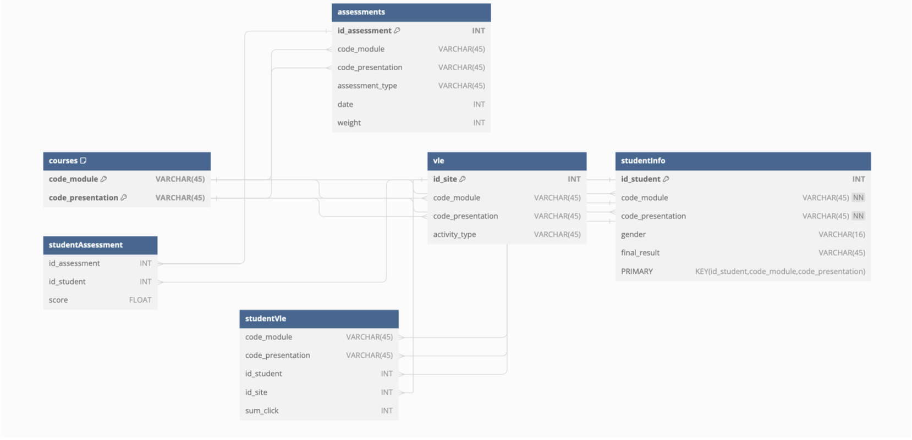
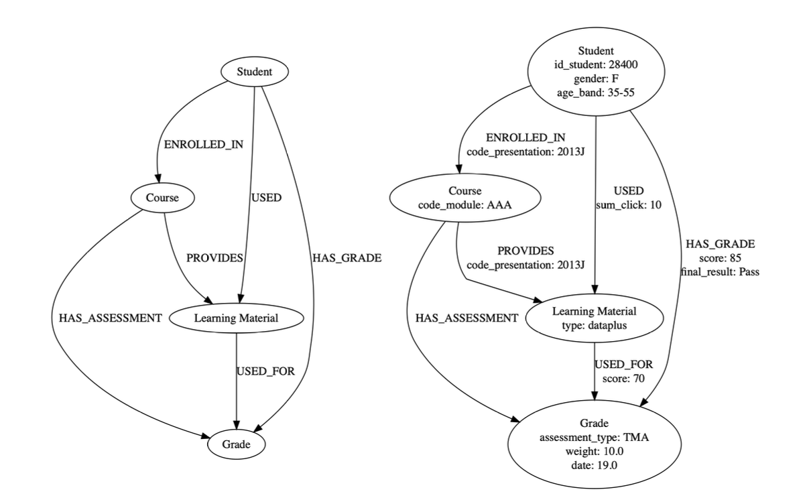

# modern_database_systems
Comparative analysis of Relational vs. Graph Databases in an educational context. Using the OULAD dataset, we implemented queries to identify at-risk students and provide personalized learning recommendations. The project highlights Neo4j's efficiency in handling complex, interconnected student data compared to traditional SQL joins. 

> This project was developed as part of the course Modern Database Systems at TH Cologne and implemented collaboratively in a team.

## Collaborators 
Natalie Hußfeldt, Anh Thu Bui

## Motivation & Use Case

Universities aim to improve **student success**, **teaching quality**, and **graduation rates**.  
Data‑driven analytics enable:

- early detection of **at‑risk students**  
- recommendation of **relevant study materials**  
- better understanding of **engagement patterns** and course performance

Key tasks in this project:

- identify students in specific courses and academic terms  
- track interactions with online learning materials  
- correlate these interactions with grades and outcomes  
- recommend materials or peers to improve engagement  
- analyze student cohorts at module or class level

## Dataset (OULAD)

We use the **Open University Learning Analytics Dataset (OULAD)** from Kaggle.

It contains anonymized data about:

- **Modules/courses**
- **Students**
- **Virtual Learning Environment (VLE) interactions**
- **Assessments and grades**

The dataset consists of multiple CSV files linked via unique identifiers (e.g., `student_id`, `module_code`):

- `courses.csv` – basic course/module information  
- `vle.csv` – learning materials and VLE activities  
- `assessments.csv` – assessment metadata  
- `studentInfo.csv` – student demographics and status  
- `studentAssessment.csv` – student assessment results  
- `studentVle.csv` – clickstream of student–VLE interactions (largest file)[file:144]

Due to storage limits on the NoSQL side, the dataset was slightly reduced; `studentRegistration.csv` was not used.

## Database Designs

We compare two data models and implementations:

### 1. Relational Model – PostgreSQL

- **PostgreSQL 16.3**, locally hosted
  

### 2. Graph Model – Neo4j

- **Neo4j AuraDB Free** (version `5.20-aura`), hosted online

## Tech Stack

- **Relational DB**: PostgreSQL 16.3  
- **Graph DB**: Neo4j AuraDB Free 5.20‑aura  
- **Data**: OULAD (Kaggle) CSVs  
- **Languages/Tools**: 
  - SQL for PostgreSQL  
  - Cypher for Neo4j
  - Python and Jupyter Notebooks for plotting and data cleaning
